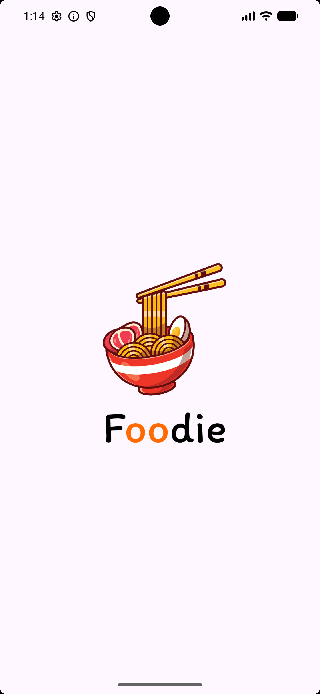
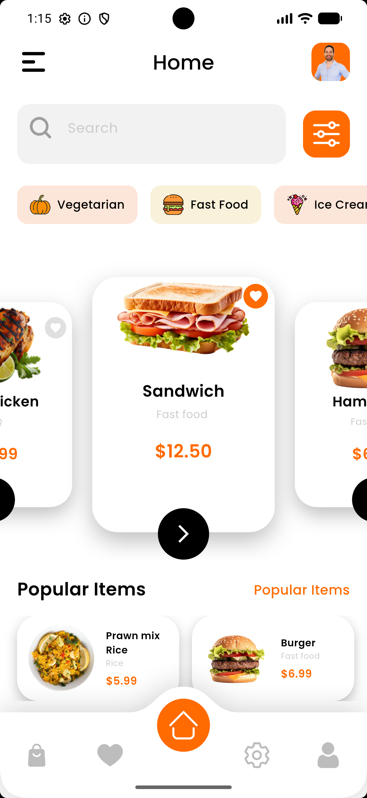
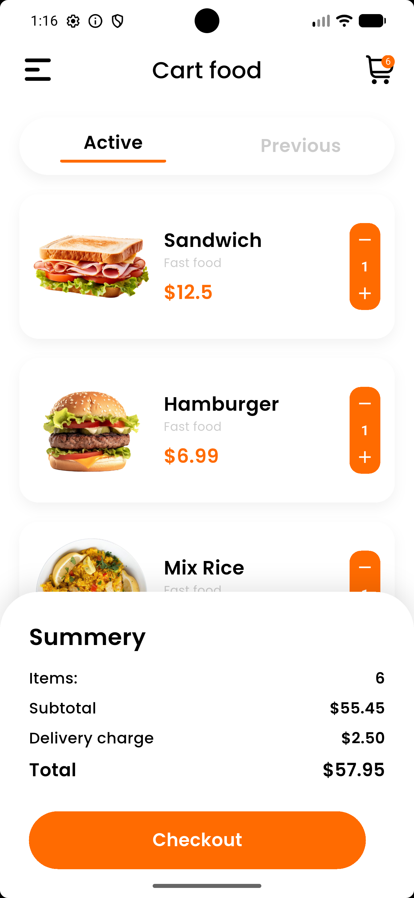

# 🍔 Food Shop - High-Fidelity Food Delivery UI

[](https://flutter.dev/)
[](https://dart.dev/)
[](https://flutter.dev/)

A premium, production-ready Food Delivery UI built with Flutter. This project focuses on delivering
a seamless user experience through custom-engineered components, responsive scaling, and interactive
state management.

---

## 📱 Visual Preview

<p align="center">
  
  
  
  
</p>

---

## 🛠️ Technical Implementation

### 📐 Responsive Architecture

- **Unified Scaling**: Leverages `flutter_screenutil` for precise UI scaling across different screen
  densities and aspect ratios.
- **Adaptive Layouts**: Implemented flexible constraints to ensure the UI remains consistent on both
  compact and large display mobile devices.

### 🎨 Custom UI Engineering

- **Dynamic Bottom Navigation**: A custom-drawn navigation bar using `BNBCustomPainter`. It features
  a sharp-edged top border and a dynamic Bézier curve "hump" that programmatically follows the
  active index.
- **Advanced Typography**: Integrated `Google Fonts (Poppins)` via a centralized `AppStyles` utility
  for consistent branding.
- **Interactive Product Details**: A stateful detail screen featuring interactive quantity
  management and size selection.

### 🛒 Cart & State Logic

- **Real-time Calculations**: Automatic subtotal and total price updates based on cart item quantity
  changes.
- **Clean Data Flow**: Structured model-view interaction for product data passing from the catalog
  to detail and cart views.

---

## 🚀 Getting Started

### Prerequisites

- [Flutter SDK](https://flutter.dev/docs/get-started/install) (Stable Channel)
- Android Studio or VS Code

### Installation

1. **Clone the repository**
   ```bash
   git clone https://github.com/yourusername/food_shop.git
   ```

2. **Install dependencies**
   ```bash
   flutter pub get
   ```

3. **Run the application**
   ```bash
   flutter run
   ```

---

## 📁 Project Structure

```text
lib/
├── main.dart             # App entry point & ScreenUtil initialization
├── screens/
│   ├── splash.dart       # Animated entry screen
│   ├── home.dart         # Home catalog & Custom Bottom Nav
│   ├── Food details.dart # Interactive product configuration
│   └── Cart Food.dart    # Cart management & summary logic
└── utils/
    ├── App Colors.dart   # Centralized theme colors
    └── App Styles.dart   # Standardized text & UI styles
```

---

## ✅ Project Status

- [x] **Splash Sequence**: Branded entry animation.
- [x] **Responsive Home**: Adaptive food catalog.
- [x] **Custom Navigation**: Pixel-perfect notched Bottom Bar.
- [x] **Product Configuration**: Detail view with size/quantity state.
- [x] **Cart System**: Real-time checkout summary and item list.

---

Developed with ❤️ by **Amira**
